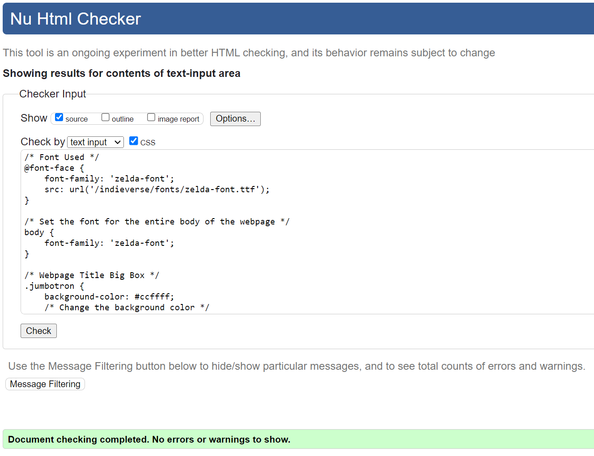

# Project: A Journey of Resilience and Determination

## Introduction

This project is a testament to the power of resilience, a story of a phoenix rising from the ashes. It is the second attempt at building a webpage from scratch, born from the lessons learned from a previous endeavor that didn't go as planned. You can find the initial attempt [here](https://lihmartins.github.io/CodeProjectStudies/).

### The Journey

The journey was not easy. After grappling with the complexities of the first project, the decision to start over was not taken lightly. But the love for the project concept and the determination to bring it to life fueled the resolve to try again.

These projects are more than just practice projects; they represent the first steps into the world of coding. Each step was taken with a deeper understanding, each line of code written with valuable information gathered along the journey.

### The Struggle and Triumph

The path was fraught with challenges. Striving for perfection, ensuring that every detail was in place, and making the webpage functional across all types of devices was no small feat. But every struggle, every moment spent cracking the code, was worth it.

### More Than Just a Webpage

This project is more than just a webpage. It is a symbol of perseverance, a proof of the ability to overcome obstacles and to keep going, no matter how tough the journey gets. It is a reminder to take a breath, start over, and believe in the power of 'I can do it'.

This project is a message to everyone embarking on a new journey: You can do it. No matter how many times you stumble or fall, remember, it's all part of the journey. Embrace it, learn from it, and keep moving forward. Because in the end, the triumph of overcoming is the most beautiful part of the story.

## INDIEVERSE

Welcome to Indieverse, your go-to platform for exploring the vibrant world of indie games and their passionate developers. In the vast universe of gaming, Indieverse serves as a cosmic hub where gamers can discover, learn, and connect with unique indie titles that often fly under the radar.

## Overview

In the vast galaxy of gaming, Indieverse stands as a shining constellation dedicated to indie games and their visionary developers. Here, gamers are invited to escape the gravitational pull of conventional titles and explore the uncharted realms of indie gems. Our mission is to provide a platform where indie games take centre stage, and the developers' stories become constellations in the vastness of the gaming cosmos.

### Indieverse Layout Design: A Harmonious Blend of Minimalism and Artistry

Indieverse’s layout design is a testament to the harmonious blend of minimalism and artistry. The design philosophy was to create a user interface that is both aesthetically pleasing and easy to navigate, while also incorporating a unique visual identity.

The Indieverse logo is prominently displayed on the main page, immediately capturing the user’s attention upon arrival. This strategic placement ensures a consistent brand presence throughout the user’s journey, fostering a cohesive and memorable experience.

The content pages are designed with simplicity in mind. The aim is to present information in a clear and straightforward manner, eliminating unnecessary complexity. The navigation menus are intuitively designed, enabling users to effortlessly access different sections of the website.

The color palette, featuring varying shades of turquoise and pink, creates a visually appealing and “cosy” ambiance. The use of the font from the my all-time favourite game, Legend of Zelda, adds an element of authority, while the vibrant colors keep the webpage looking inviting and warm.

The menu exudes a sense of fun and entertainment, promising users an engaging experience as they navigate through the game reviews - the heart of the Indieverse experience.

In the end, the layout successfully encapsulates the essence of minimalism and creativity. Despite the challenges, the final design aligns with the initial vision, offering users a visually appealing and user-friendly website. Indieverse serves as a testament to the creative journey of blending simplicity with a dash of flair, carving out a unique niche in the vast digital landscape.

For the first time in a long while, I have been able to channel my creativity into a project I love. Indieverse is the product of a creative mind that’s just beginning to shake off the rust and explore its potential.

## Features

- **Home: Explore the Cosmic Gateway:**
The main page welcomes users to Indieverse, providing a cosmic introduction to the universe of indie games. Users will find a brief overview of what Indieverse is all about, setting the stage for an extraordinary journey into the world of indie gaming.

- **About: Unveiling the Stargazer:**
The "About" section is a personal odyssey, offering a glimpse into the creator behind Indieverse. Discover the stargaser, the passionate gamer who embarked on a mission to bring indie games to the forefront. Get to know the force driving Indieverse and the commitment to celebrating indie creativity.

- **Games: Navigating the Celestial Library**
The heart of Indieverse, the "Games" section, is a celestial library of indie wonders. Users can explore a main page that teases upcoming reviews and sets the stage for gaming adventures. Dive deeper into the cosmos with a sub-menu featuring in-depth reviews of specific indie games. While Cult of The Lamb is the pioneer, more games will be slated for exploration in the future

- **Contact: Connecting Stars**
Indieverse isn't just a portal; it's a community. The "Contact" page invites users to become part of the cosmic conversation. Whether it's sharing feedback, suggesting games for review, or developers seeking visibility, the contact page is the interstellar hub for connections.

- **Footer: Where Love Meets Bits and Bytes**
In the digital constellation of Indieverse, the footer is the cosmic bookmark that leaves an imprint of care and connection. Here, two stellar features shine brightly:

- **Crafted Affection**
Beneath the pixelated sky, the footer proudly displays the handcrafted badge of love. Every pixel, every line, and every word is a labour of affection from the Indieverse Crew. It's more than a copyright statement; it's a declaration of commitment. Crafted with love, our digital creation invites you to explore the boundless galaxies of indie gaming.

As you scroll through the cosmic tapestry of Indieverse, the footer whispers tales of care and passion—where bits and bytes embrace in a celestial dance. It's not just a sign-off; it's a cosmic hug, inviting you to experience indie gaming like never before.

- **Cosmic Connections**
Connect with the heart behind Indieverse through these cosmic portals:

- Explore the creator's gaming universe on Steam: [Steam Profile](https://steamcommunity.com/id/fucoffeelih)
- Reach out to the Indieverse Crew via email at: [Email](mailto:mynameisnotlih@gmail.com)

*Note: Indieverse has personalized these Bootstrap icons to match the unique style of our page.*

- **More Features to be Added in the Future**
Indieverse's features are carefully crafted to cater to gamers, developers, and dreamers alike. This cosmic journey is just beginning, with plans to unveil even more celestial features in the future. Welcome to Indieverse—where every feature is a star in the vast universe of indie gaming!

## Validator Testing

### HTML

No errors were returned when passing through the official [!WRC Validator](https://validator.w3.org/nu/)

**About**

**Confirmation Page**

**Contact**

**Cult of The Lamb Page**

**Games**

**Index**

### CSS

No errors were found when passing through the official [!WRC Validator](https://validator.w3.org/nu/)

**About**

**Confirmation Page**

**Contact**

**Cult of the Lamb Page**

**Games**

**Style**

## WCAG Contrast Check

**Logo Banner and Title**

**Menu Bar**

**Content Container**

## Unfixed Bugs

Indieverse is committed to providing a seamless user experience, and we actively address and resolve bugs. However, this time no bugs were found. Hurray!

## Deployment

Deploying Indieverse to GitHub was a challenging yet rewarding journey once again, but practice makes perfect, right?

### Steps to Deploy

1. **Linking Visual Studio Code to GitHub:**
   - To initiate the deployment process, I first linked my Visual Studio Code directory to a GitHub's repository.
   - The steps taken was to push my Directory, through Source Control, creating a new repository in GitHub named 'indieverse'

2. **Adjusting Branch for Deployment:**
   - As part of the deployment setup, I had to adjust the branch settings.
   - I first created a new environment, on the environment's tab;
   - I then configured it to Selected Branch and Tags on the Deployment Branches and Tags section;
   - I added a deployment branch named as the Indieverse's branch: *'main'*;
   - The steps above were provided by Visual Studio Code documentation: [Intro to Git - Publish local repository to GitHub](https://code.visualstudio.com/docs/sourcecontrol/intro-to-git#:~:text=Publish%20local%20repository%20to%20GitHub&text=Use%20the%20Publish%20to%20GitHub,code%20to%20the%20remote%20repository.)

3. **GitHub Pages Deployment:**
   - On Pages tab I changed the branch from None to main;
   - The Main branch selection triggered an automatic refresh, and a detailed ribbon display confirmed the successful deployment.

### Live Content

The live version of Indieverse is accessible [here]( https://lihmartins.github.io/indieverse).

## Credits

Embarking on the journey of refining my passion project was the catalyst I needed to reignite my enthusiasm. I immersed myself in extensive research, gathering the necessary information to kick-start my project. The resources acknowledged in this Credits section served as my guiding light, providing invaluable insights that helped me identify my missteps and chart a new course towards success.

### Websites and Resources Used

## Credits

Here are some of the resources that were instrumental in the creation of Indieverse:

- [Best Image Dimension Check](https://www.shopify.com/nz/blog/image-sizes)
- [Boostrap Tutorial](https://www.w3schools.com/bootstrap/default.asp)
- [Understanding Divs](https://blog.hubspot.com/website/what-div-in-html)
- [CSS Tutorial](https://www.w3schools.com/css/default.asp)
- [HTML Tutorial](https://www.w3schools.com/html/default.asp)
- [Webflow University - Interactive Learning](https://university.webflow.com/interactive-learning)

### Webpage Bootstrap Template

- [Webpage Template](https://www.w3schools.com/howto/tryit.asp?filename=tryhow_website_bootstrap&stacked=h)

### NavBar Bootstrap Template

- [Bootstrap NavBar](https://www.w3schools.com/bootstrap/tryit.asp?filename=trybs_navbar_collapse&stacked=h)

### Zelda Font

- [Zelda Font](https://zeldauniverse.net/media/fonts/)
  
### Favicon

- [Favicon Generator](https://favicon.io/favicon-converter/)

### Icons for Footer

Utilized Bootstrap Icons from

- [Bootstrap Icons](https://cdn.jsdelivr.net/npm/bootstrap-icons@1.11.3/font/bootstrap-icons.min.css)

### Video Content

Integrated YouTube videos for gameplay:

- [Cult of Lamb Gameplay with Devs](https://www.youtube.com/embed/KxEe6n9nqrk)
- [dotAge Gameplay](https://www.youtube.com/embed/m4crJPLWC30)

### GIFs

Included GIFs from:

- [Tenor GIF](https://tenor.com/brzZ7.gif)
- [Tenor GIF](https://media1.tenor.com/m/pQGITlIh3jQAAAAC/computer-games.gif)

### Logo Creation

Designed the Indieverse logo using [Designs.ai Logo Maker](https://designs.ai/en/logomaker)

### Contrast Checker

- [Contrast Checker](https://accessibleweb.com/color-contrast-checker/)

## Lighthouse Desktop Performance

While I'm proud of the aesthetic and functionality of my webpage, its performance as measured by Google's Lighthouse tool has been a point of frustration. Despite my best efforts to address the issues identified by Lighthouse, achieving a perfect score of 100 without altering the layout of my site has proven to be a challenging task.

I've attempted to address the issues to the best of my ability, but there's still work to be done. I'm committed to learning and improving, so if anyone has insights or suggestions on how to boost my Lighthouse score without compromising the current layout and design of the site, your input would be greatly appreciated. Please feel free to reach out!

**About**

**Contact**

**Cult of the Lamb Page**

**Games**

**Main Page**

## Lighthouse Mobile Performance

**About**

**Contact**

**Cult of the Lamb**

**Games**

**Index**

## Finals

Indieverse is not just a website; it's a cosmic journey into the indie gaming universe. The project blends creativity, community, and a love for indie games to offer users a unique and engaging experience. From detailed game reviews to personal connections in the About and Contact sections, Indieverse is a testament to the dedication and passion for indie gaming.

Crafted with ❤️ by the Indieverse Crew © 2024. All rights reserved.
